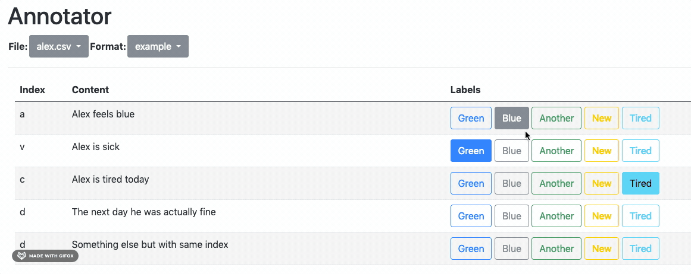

# Genna - A Generative AI Basic Annotator Tool
This is a simple annotator tool that uses LLMs to prepare and label data

## Installation & Use
 1. conda create --name genna python=3.7
 2. pip install -r requirements.txt
 3. Go down a level `cd genna`
 4. Review `config.yaml` it will describe what you want to analyze.  
   `labels_config` is a list of labels you want to assign.  
   `index_cols` - the column used as index and `target` the column you absolutely need to annotate
 
## Usage
 1. Place the input file into `data/datasets` make sure it matches some config available or add a new config. Note, the tool expects csv files and those will be read with pandas.read_csv()
 2. Run as `python app.py`. Annotations are saved to `data/annotations`
 3. Do not forget to restart the server if you add new files or new configs, 

 NB: Annotations use the column specified as `index_cols` if that column is not unique, annotation will be ambiguous

 ## Alex the example
 This is Alex, he is an example

 1. Notice how there can be a number of labels per row (defined in the config file)
 2. You can label and un-label as you like and feel
 3. If two lines have the same index, labels will be ambiguous
 

  

